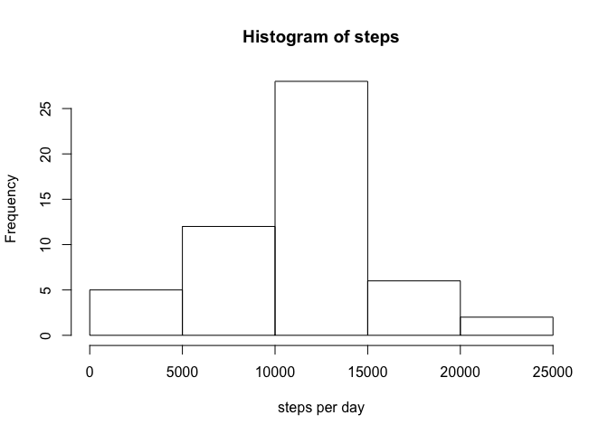
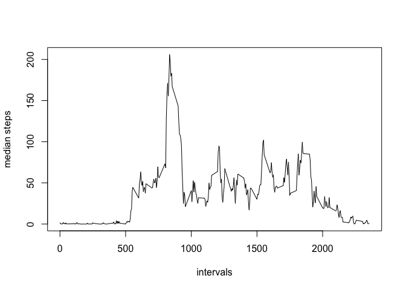
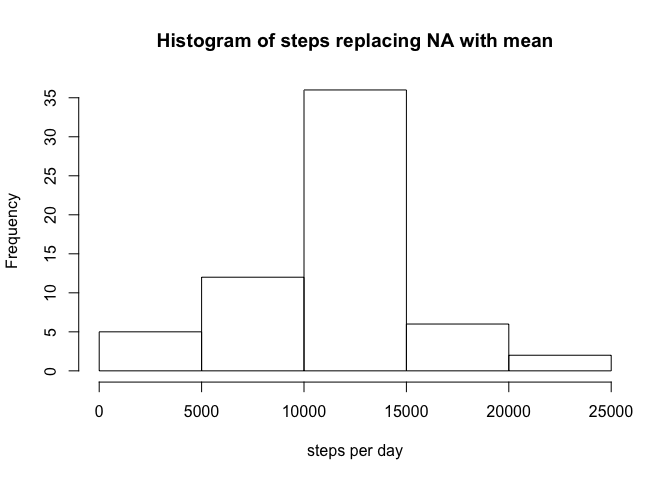
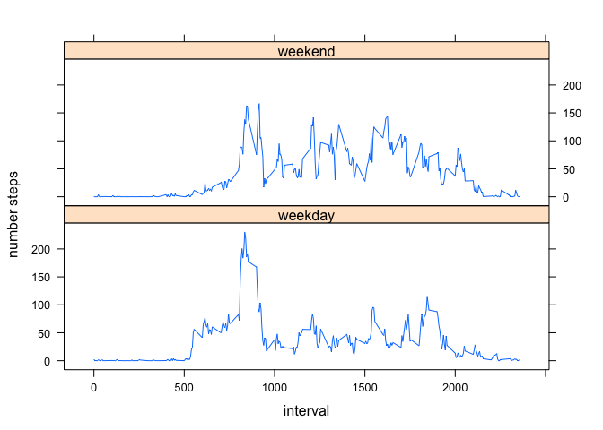

# Reproducible Research: Peer Assessment 1


## Loading and preprocessing the data

```r
df<-read.csv(unzip("activity.zip"))
df_complete <- na.omit(df)
```
To calculate the steps per day:

```r
df_steps <- aggregate(df_complete$steps, by=list(df_complete$date), sum)$x
```


## What is mean total number of steps taken per day?

```r
hist(df_steps, xlab = "steps per day", main = "Histogram of steps excluding NA")
```

 

```r
mean(df_steps)
```

```
## [1] 10766.19
```

```r
median(df_steps)
```

```
## [1] 10765
```


## What is the average daily activity pattern?

```r
df_intervals <- df[,c(1,3)]
df_steps_intervals <- aggregate(df_intervals, by=list(df_intervals$interval), mean, na.rm=TRUE)
plot(df_steps_intervals$interval, df_steps_intervals$steps , type='l', xlab = "intervals", ylab="number steps")
```

 

The interval with the maximun number of steps is

```r
df_steps_intervals[which.max(df_steps_intervals$steps),]$interval
```

```
## [1] 835
```


## Imputing missing values
The number of no completed cases (rows with NA values):

```r
sum(!complete.cases(df))
```

```
## [1] 2304
```
we'll replace the NA with the mean number of steps in that intervall

```r
steps_in_interval <- function(interval, steps){
  if (is.na(steps))
    steps <- round((df_steps_intervals[df_steps_intervals$interval==interval, "steps"]))
   
  return (steps)
}

df2 <- df
df2$steps <- mapply(steps_in_interval, df2$interval, df2$steps)
```

graph on the new data and mean and median

```r
df2_steps <- tapply(df2$steps, df2$date, sum)
hist(df2_steps, xlab = "steps per day", main = "Histogram of steps replacing NA with mean")
```

 

```r
mean(df2_steps)
```

```
## [1] 10765.64
```

```r
median(df2_steps)
```

```
## [1] 10762
```

Obviusly the data are different than the original data. We see the Mean bar bigger !


## Are there differences in activity patterns between weekdays and weekends?

weekend / weekday factor

```r
df2$day <- factor(ifelse(weekdays(as.Date(df2$date)) %in% c("Sunday", "Saturday") ,"weekend", "weekday"))
```


```r
df_weekday_steps <- aggregate(df2$steps, by=list(interval=df2$interval, weekday=df2$day), mean)

library(lattice)
xyplot( df_weekday_steps$x ~ df_weekday_steps$interval | df_weekday_steps$weekday, type = "l", xlab = "interval", ylab = "number steps", layout = c(1, 2) )
```

 
from the graph it is possible to see that people walks less during the week and they walk more in the morning. During the weekend the people walk the same during the whole day.

