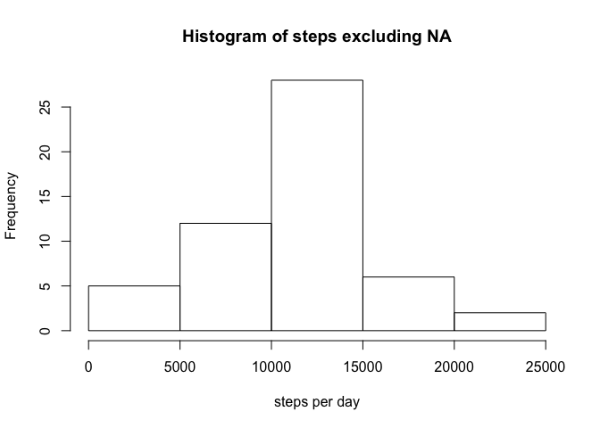

# Reproducible Research: Peer Assessment 1


## Loading and preprocessing the data

```r
df<-read.csv(unzip("activity.zip"))
```
To calculate the steps per day:

```r
df_steps <- tapply(df$steps, df$date, sum, na.rm = TRUE)
```


## What is mean total number of steps taken per day?

```r
hist(df_steps, xlab = "steps per day")
```

 

```r
mean(df_steps)
```

```
## [1] 9354.23
```

```r
median(df_steps)
```

```
## [1] 10395
```


## What is the average daily activity pattern?

```r
df_intervals <- df[,c(1,3)]
df_steps_intervals <- aggregate(df_intervals, by=list(df_intervals$interval), mean, na.rm=TRUE)
plot(df_steps_intervals$interval, df_steps_intervals$steps , type='l', xlab = "intervals", ylab="median steps")
```

 

The interval with the maximun number of steps is

```r
df_steps_intervals[which.max(df_steps_intervals$steps),]$interval
```

```
## [1] 835
```


## Imputing missing values


## Are there differences in activity patterns between weekdays and weekends?
